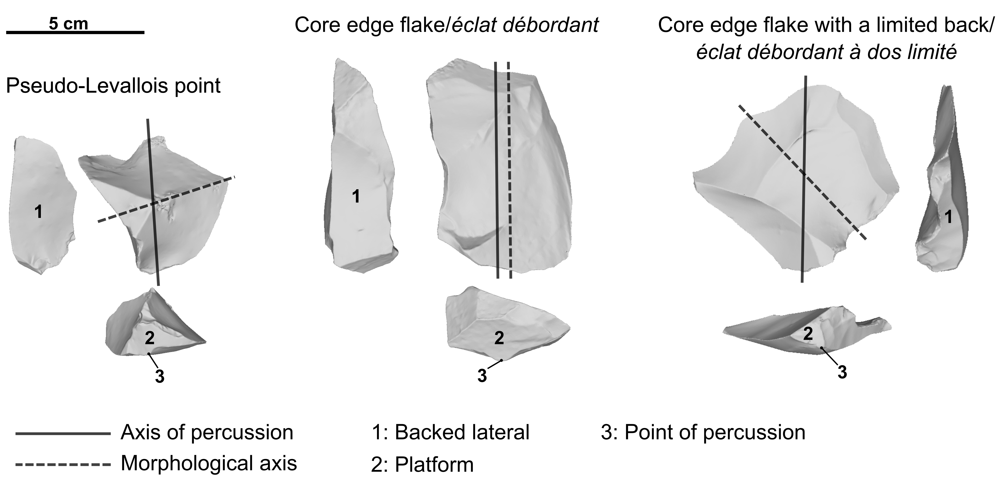
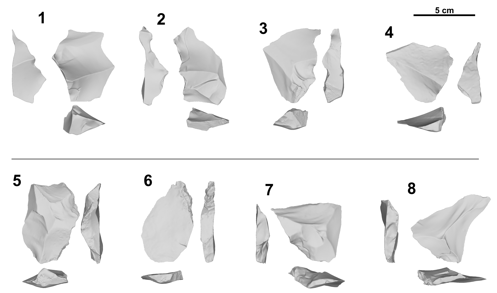
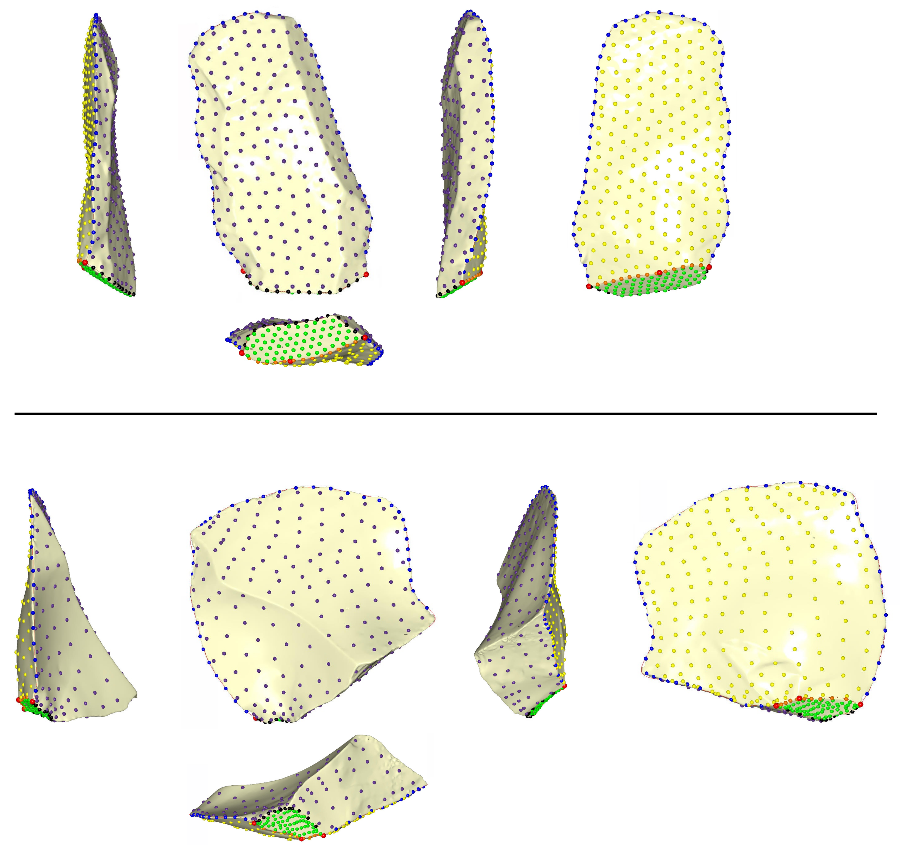
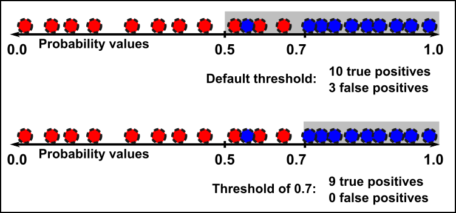

```{r setup, include=FALSE}
knitr::opts_chunk$set(echo = TRUE)
```

# Combining quantitative approaches to differentiate between backed products from discoidal and Levallois reduction sequences       

Guillermo  Bustos-Pérez$^{1,2,3}$      
Brad Gravina$^{4,5}$  
Michel Brenet$^{5,6}$   
Francesca Romagnoli$^1$     

$^1$Universidad Autónoma de Madrid. Departamento de Prehistoria y Arqueología, Campus de Cantoblanco, 28049 Madrid, Spain    
$^2$Institut Català de Paleoecologia Humana i Evolució Social (IPHES), Zona Educacional 4, Campus Sescelades URV (Edifici W3), 43007 Tarragona, Spain    
$^3$Àrea de Prehistoria, Universitat Rovira i Virgili (URV), Avinguda de Catalunya 35, 43002 Tarragona, Spain   
$^4$Musée national de Préhistoire, MCC, 1 rue du Musée, 24260 Les Eyzies de Tayac, France   
$^5$UMR-5199 PACEA, Université de Bordeaux, Bâtiment B8, Allée Geoffroy Saint Hilaire, CS 50023, 33615 PESSAC CEDEX, France    
$^6$INRAP Grand Sud-Ouest, Centre mixte de recherches archéologiques, Domaine de Campagne, 242460 Campagne, France    

Corresponding authors:   
G.B.P. guillermo.willbustos@mail.com   
F.R. f.romagnoli2@gmail.com   

## Abstract   
Backed flakes (core edge flakes and pseudo-Levallois points) represent special products of Middle Paleolithic centripetal flaking strategies. Their peculiarities are due to their roles as both a technological objective and in the management of core convexities to retain its geometric properties during reduction. In Middle Paleolithic contexts, these backed implements are commonly produced during Levallois and discoidal reduction sequences. Backed products from Levallois and discoidal reduction sequences often show common geometric and morphological features that complicate their attribution to one of these methods. This study examines the identification of experimentally produced discoidal and recurrent centripetal Levallois backed products (including all stages of reduction) based on their morphological features. 3D geometric morphometrics are employed to quantify morphological variability among the experimental sample. Dimensionality reduction though principal component analysis is combined with 11 machine learning models for the identification of knapping methods. A supported vector machine with polynomial kernel has been identified as the best model (with a general accuracy of 0.76 and an area under the curve [AUC] of 0.8). This indicates that combining geometric morphometrics, principal component analysis, and machine learning models succeeds in capturing the morphological differences of backed products according to the knapping method.   

**Key words**: lithic analysis; Levallois; Discoid; Geometric Morphometrics; Machine Learning; Deep Learning    

## 1. Introduction   

The Middle Paleolithic in Western Europe is characterized by the diversification and increase of knapping methods resulting in flake-dominated assemblages [@kuhn_roots_2013; @hovers_diversity_2006]. Discoidal and the recurrent centripetal Levallois are two of the most common flake production systems during this period. Following Boëda [-@boeda_debitage_1993; -@boeda_concept_1994; -@dibble_levallois:_1995], there are six technological criteria that define discoidal debitage:    

  1. The volume of the core is conceived as two oblique asymmetric convex surfaces delimited by an intersection plane;  
  2. These two surfaces are not hierarchical being possible to alternate the roles of percussion and exploitation surfaces;  
  3. The peripheral convexity of the debitage surface is managed to control lateral and distal extractions thus allowing for a degree of predetermination;   
  4. Surfaces of the striking planes are oriented in a way that the core edge is perpendicular to the predetermined products;   
  5. The fracture planes are secant;   
  6. The technique employed is the direct percussion with hard hammer.   
  
In addition, according to Boëda [-@boeda_debitage_1993; -@boeda_concept_1994] six characteristics define the Levallois knapping strategy:   

  1. The volume of the core is conceived in two convex asymmetric surfaces;  
  2. These two surfaces are hierarchical and are not interchangeable. They maintain their role of striking and debitage (or exploitation) surface respectively along the whole reduction process;  
  3. The distal and lateral convexities of the debitage surface are maintained to  obtain predetermined flakes;  
  4. The fracture plane of the predetermined products is parallel to the intersection between both surfaces;    
  5. The striking platform is perpendicular to the overhang (the core edge, at the intersection between the two core surfaces);  
  6. The technique employed during the knapping process is the direct percussion with hard hammer. 

Depending on the organization of the debitage surface Levallois cores are usually classified into preferential method (were a single predetermined Levallois flake is obtained from the debitage surface) or recurrent methods (were several predetermined flakes are produced from the debitage surface) with removals being either unidirectional, bidirectional or centripetal [@dibble_levallois:_1995; @hovers_diversity_2006; @dibble_variability_1995].   



Both knapping methods involve the removal of backed products that usually comprise two categories: core edge flakes (*eclat débordant*) and pseudo-Levallois points.  
Core edge flakes / *eclat débordant* [@beyries_etude_1983; @boeda_debitage_1993; @boeda_identification_1990] are technical backed knives that have a cutting edge opposite and parallel (or sub-parallel) to an abrupt margin (a back that usually has an angle close to 90º). This back commonly results from the removal of one of the lateral edges of the core and can be plain, retain the scars from previous removals, be cortical, or a combination of these attributes. Core edge flakes are also divided into two categories: “classic core edge flakes” and “core edge flakes with a limited back.” “Classic core edge flakes” [@beyries_etude_1983; @boeda_debitage_1993; @boeda_identification_1990], which are sometimes referred to as “core edge flakes with a non-limited back”/*“éclat débordant à dos non limité”* [@duran_lindustrie_2005; @duran_variabilite_2006], have a morphological axis more or less similar to the axis of percussion. “Core edge flakes with a limited back”/*“éclat débordant à dos limité”* a offset axis of symmetry in relation to the axis of percussion [@meignen_les_1993; @meignen_persistance_1996; @pasty_etude_2004]. This orientation often leads to the back not being parallel to nor spanning the entire length of the sharp edge or the percussion axis (Slimak, 2003).  

Pseudo-Levallois points [@boeda_debitage_1993; @boeda_identification_1990; @bordes_notules_1953; @bordes_typologie_1961; @peresani_les_2003] are backed products where the edge opposite to the back has a triangular morphology. This triangular morphology is usually the result of the convergence of two or more scars. As with core edge flakes, the back usually results from the removal of one of the lateral edges of the core and can be plain, retain the scars from previous removals, or more rarely be cortical or a combination of these traits. Both pseudo-Levallois points and core edge flakes with a limited back share a symmetry offset from the axis of percussion but are clearly differentiable due to their morphology. The present study includes the three categories defined above as backed products.       

Depending on the knapping method, different roles in Levallois recurrent centripetal and discoidal debitage are attributed to core edge flakes and pseudo-Levallois points.  @boeda_identification_1990 focus on the role of core edge flakes and cortically backed flakes for maintaining the lateral convexities throughout Levallois recurrent centripetal reduction. Similarly, pseudo-Levallois points contribute to maintaining the lateral and distal convexities between different series of removals [@boeda_identification_1990].   
Focusing on the variability of discoidal debitage, @peresani_les_2003 noted that pseudo-Levallois points are short products that induce a limited lowering of the core overhang (the intersection between the striking and debitage surfaces). In contrast, core edge flakes can result from several distinct production objectives. Expanding on the roles of pseudo-Levallois points and core edge flakes within discoidal debitage, @peresani_industrie_2003 demonstrated the systematic production of both products at the site of Beauvais. This indicates that at Beauvais, core edge flakes and pseudo-Levallois points were the main predetermining/predetermined products [@peresani_industrie_2003].   


An additional added value of core edge flakes and pseudo-Levallois points is their frequent transport by Paleolithic groups. @turq_fragmented_2013 described the widespread import and export of lithic artifacts during the Middle Paleolithic. Examples of the transport of pseudo-Levallois points from discoidal production sequences can be observed at Combemenue, La Mouline, Les Fieux [@brenet_variabilite_2013; @brenet_silex_2012; @brenet_gisement_2008; @folgado_economie_2010; @turq_fragmented_2013], and the open-air site of Bout des Vergnes [@courbin_spatial_2020], while the transport of core edge flakes (into and out of the site) is also clearly observed at la Grotte Vaufrey [@rigaud_les_1988], Teixoneres cave [@bustos-perez_quantitative_2017; @picin_neanderthal_2020], Amalda Cave [@rios-garaizar_organizacion_2010], Grotta del Cavallo [@romagnoli_raw_2016], l’Arbreda [@duran_variabilite_2006] and at Site N of Maastricht-Belvédère [@roebroeks_veil_1992]. Transported backed pieces have also been clearly identified at Abric Romaní in Spain within both Levallois and discoidal production methods [@romagnoli_testing_2016; @martin-viveros_use-wear_2020]. The identification of knapping methods among these specific products can help to indentify diachronic and synchronic changes in lithic production, selection, and transport as a reflection of hominin technological organization and adaptive strategies [@binford_organization_1979; @robinson_costs_2018]   


   
The attribution of backed pieces to either discoidal or recurrent centripetal Levallois reduction can, however, be problematic. For example, @peresani_discoiou_2003 indicates that a key aspect for the identification of Levallois core edge flakes is the direction of the debitage axis, which is parallel to the intersection plane of the two core surfaces while the fracture plane is secant. @slimak_variabilite_1998 showed core edge flakes from discoidal reduction to equally have fracture planes parallel to the intersection between the debitage surface and striking platforms although not as parallel as in Levallois debitage. @delpiano_techno-functional_2021 demonstrated a tendency of Levallois products to be more elongated with thinner and sub-parallel edges, whereas discoidal backed products show a higher variation in the minimum and maximum thickness of the back. Previous studies [@archer_quantifying_2021; @gonzalez-molina_distinguishing_2020] addressed the differentiation between discoidal and recurrent centripetal Levallois products in general terms were all products are considered. While this approach is highly effective, the differentiation between backed products of discoidal and recurrent centripetal Levallois sequences is not sufficiently addressed. Given the special technological role of backed products in core management and production, their specific techno-functional properties [@delpiano_techno-functional_2021], the frequency in which they appear in the archaeological record, and their common transport as part of hominin toolkits, a more systematic approach to their accurate differentiation represents an important advancement in describing Middle Palaeolithic lithic assemblages.    

This raises the issue as to the extent to which discoidal and Levallois recurrent centripetal core edge flakes and pseudo-Levallois points can be differentiated based on their morphological features. This issue is relevant to lithic studies because it affects the technological analysis of a stone tool assemblage and the evolutionary interpretation of knapping concepts over time. Here we address this issue through experimental archaeology and a multi-level statistical approach. We reproduced classic bifacial discoidal and recurrent centripetal Levallois reduction sequences to obtain a collection of backed products. We produced 3D scans of lithic artifacts and employed geometric morphometrics to quantify the morphological variability of the experimental sample and the cores were refit. Dimensionality reduction through principal component analysis (PCA) was carried out on a set of coordinates, and 11 machine learning models were tested to obtain classification accuracy and variable importance. Geometric morphometrics and Machine Learning models make it possible to directly test technological classifications of lithic and features usually employed to discriminate between both methods.      

## 2 Methods   

### 2.1 Experimental assemblage   

The analyzed experimental assemblage derives from the replication of nine discrete knapping sequences. Seven cores were knapped in Bergerac chert [@fernandes_silex_2012], and two cores were knapped in Miocene chert from South of Madrid [@bustillo_caracterizacion_2012; @bustillo_caracteristicas_2005]. Five cores were knapped following the discoidal *“sensu stricto”* method, which corresponds highly to Boëda’s original technological definition of the knapping system [@boeda_debitage_1993; @boeda_concept_1994; @boeda_caracteristiques_1995], and five experimental cores were knapped following the Levallois recurrent centripetal system [@boeda_concept_1994; @dibble_levallois:_1995; @boeda_debitage_1993; @dibble_recurrent_1995]. A total of 139 unretouched backed flakes (independent of the type of termination) were obtained: 70 from the discoidal reduction sequences and 69 from the Levallois reduction sequences (Figure 1). In the case of the Levallois recurrent centripetal cores, backed products from both debitage and striking surfaces were included.   

The following code loads data and packages necessary for the development of the present research.   
```{r message=FALSE, warning=FALSE}
# List of packages
list.of.packages <- c("tidyverse", "caret",  "ranger")

# Load packages
lapply(list.of.packages, library, character.only = TRUE)
rm(list.of.packages)
```
```{r, Load Data}
# Loading landmarks coordinates
load("Data/Flakes LM rotated.RData")

# Loading manual attributes
Att <- read.csv("Data/Attributes data.csv")
```


The Levallois recurrent centripetal experimental assemblage is clearly dominated by non-cortical backed flakes (n = 42; 60.87%). This is expected since one of the roles of core edge flakes and pseudo-Levallois points in Levallois recurrent centripetal methods is the management of convexities on subsequent exploitation sequences [@boeda_debitage_1993; @boeda_concept_1994; @boeda_identification_1990]. Thus, although backed flakes can be present in the initial decortication phases (n = 9; 13.04%), the subsequent exploitation of the core will result in non-cortical flakes. Non-cortical backed flakes are also the majority class of the experimental Discoid assemblage although this predominance is attenuated (n = 29; 41.43%). However, along with flakes with nearly 25% of the dorsal surface covered with cortex, they make up the majority of the discoidal backed flakes of the assemblage (n = 51; 72.86%). This reduction in the predominance of non-cortical flakes is also expected in discoidal methods given the organization of both debitage surfaces, the nature of the surface convexities, and the fracture plane. In discoidal cores, the interchangeable surfaces usually have a higher apical convexity than Levallois cores. Additionally, the angle and removal of flakes cover a smaller portion of the respective surface than in a Levallois core. Thus, it is expected that as reduction continues, some products will retain a certain amount of cortex.      

```{r Cortex Method, fig.width=10, fig.height=4}
# Cortex & method
Att %>% group_by(Strategy) %>% 
  count(CORTEX) %>% 
  mutate(Percentage = round(n/sum(n)*100, 2)) %>%
  ggplot(aes(CORTEX, Percentage, fill = Strategy)) +
  geom_col(position = "dodge") +
  ggsci::scale_fill_aaas() +
  xlab(NULL) +
  geom_text(aes(label = paste0(Percentage, "%")), 
            vjust= -0.2, size = 2.5,
            position = position_dodge(.9)) +
  geom_text(aes(label = paste("n =", n)), 
            vjust = "top", size = 2.5,
            position = position_dodge(.9)) +
  theme_classic() +
  theme(
    legend.position = "bottom",
    axis.text = element_text(color = "black", size = 8))
```

### 2.2 Data acquisition  

All flakes were scanned with an Academia 20 structured light surface scanner (Creaform 3D) at a 0.2 mm resolution. Flakes were scanned in two parts and automatically aligned (or manually aligned in case automatic alignment failed) and exported in STL formats. Cloudcompare 2.11.3 (https://www.danielgm.net/cc/) free software was employed to perform additional cleaning, mesh sampling, surface reconstruction, and transformation into PLY files. Finally, all files were decimated to a quality of 50,000 faces using the Rvcg v.0.21 R package [@schlager_morpho_2017].   

The protocol for the digitalization of landmarks on flakes was based on previous studies [@archer_quantifying_2021; @archer_geometric_2018]. This included the positioning of a total of 3 fixed landmarks, 85 curve semi-landmarks, and 420 surface semi-landmarks [@bookstein_morphometric_1997; @bookstein_landmark_1997; @gunz_semilandmarks_2005; @gunz_semilandmarks_2013; @mitteroecker_advances_2009]. This makes for a total of 508 landmarks and semi-landmarks. The three fixed landmarks correspond to both laterals of the platform width, and the percussion point. The 85 curve semi-landmarks correspond to the internal and exterior curve outlines of the platform (15 semi-landmarks each) and the edge of the flake (55 semi-landmarks), and the 60 surface semi-landmarks correspond to the platform surface. The dorsal and ventral surfaces are defined by 180 semi-landmarks each. The workflow for digitalizing the landmarks and semi-landmarks included the creation of a template/atlas on an arbitrary selected flake. After this, the landmarks and semi-landmarks were positioned in each specimen and were relaxed to minimize bending energy [@bookstein_morphometric_1997; @bookstein_landmark_1997]. The entire workflow of landmark and semi-landmarks digitalization and relaxation to minimize bending energy was done in Viewbox version 4.1.0.12 (http://www.dhal.com/viewbox.htm), and resulting point coordinates were exported into .xlsx files.    

Procrustes superimposition [@kendall_shape_1984; @mitteroecker_advances_2009; @ohiggins_study_2000] was performed using the package “Morpho" v.2.9 [@schlager_morpho_2017] on RStudio IDE [@rstudio_team_rstudio_2019; @r_core_team_r_2019]. After performing Procrustes superimposition and obtaining a new set of coordinates, PCA was performed to reduce the dimensionality of the data [@james_introduction_2013; @pearson_lines_1901]. There are multiple reasons to use dimensionality reduction when dealing with high dimensional data on classification, including to avoid having more predictors than observations (p > n), to avoid the collinearity of predictors, to reduce the dimensions of the feature space, and to avoid overfitting due to an excessive number of degrees of freedom (simple structure with lower number of variables). PCA achieves dimensionality reduction by identifying the linear combinations that best represent the predictors in an unsupervised manner. The principal components (PCs) of a PCA are aimed to capture as high a variance as possible of the complete data [@james_introduction_2013], and PCs that capture a higher variance do not necessarily need to be the best for classification. For the present work, PCs that represent 95% of the variance were selected as predictors for training the machine learning models. The threshold of 95% of the variance was arbitrarily selected since it balances retaining most of the dataset variance on a reduced number of variables. The identification of best PCs for classification was automatically done by the machine learning models using the caret v.6.0.92 package [@kuhn_building_2008].   

   
    
A drawback exists in the interpretability of PCA as a result of its nature of reducing dimensionality through the identification of linear combinations of variables. Because of this, interpreting what morphological features are being capture by a PC can be difficult. An option for interpreting PC is to use manual measurements as predictive variables on multiple linear regressions to predict PC values. In addition to geometric morphometrics, the following attributes were recorded for each of the flakes using the E5 software [@mcpherron_e5_2019].    

  * **Technological length:** measured in mm along the axis perpendicular to the striking platform.   
  * **Technological width:** measured in mm along the axis perpendicular to the technological length.   
  * **Maximum thickness** of the flake measured in mm.    
  * **External platform angle (EPA):** measured in degrees with a manual goniometer.   
  * **Internal platform angle (EPA):** measured in degrees with a manual goniometer.   
  * **Relative amount of cortex on the dorsal face**: recorded according to its extension on the dorsal surface of the flake, with categories as follows: 0 (no cortex), 1 (nearly 25% covered by cortex), 2 (nearly 50% covered by cortex), 3 (nearly 75% covered by cortex), and 4 (nearly the entire surface covered by cortex). This variable was employed to evaluate the distribution of cortex proportions among the experimental assemblage.   
  * **Weight**: measured to a precision of 0.01 g.   
  
These measures served to generate the following indices:   

  * **Elongation index**: length divided by width.  
  * **Carenation index**: result of dividing either width or length (the one with the lowest value) between maximum thickness.   
  * **Width to thickness ratio**: flake width divided by maximum thickness.    

These measures are not intended as inputs for the Machine Learning models, but to explore the meaning of the Principal Components through multiple linear regressions.     

### 2.3 Machine learning models and evaluation   

The following 11 machine learning models have been tested for differentiating between backed flakes extracted from the two surfaces of the core within each knapping method:   

  * **Linear discriminant analysis (LDA):** reduces dimensionality aiming to maximize the separation between classes while decision boundaries divide the predictor range into regions [@fisher_use_1936; @james_introduction_2013].   
  * **K-nearest neighbor (KNN):** classifies cases by assigning the class of similar known cases. The “k” in KNN references the number of cases (neighbors) to consider when assigning a class, and it must be found by testing different values. Given that KNN uses distance metrics to compute nearest neighbors and that each variable is in different scales, it is necessary to scale and center the data prior to fitting the model [@cover_nearest_1967; @lantz_machine_2019].   
  * **Logistic regression:** essentially adapts continuous regression predictions to categorical outcomes [@cramer_early_2004; @walker_estimation_1967].   
  * **Decision tree with C5.0** algorithm: is an improvement on decision trees for classification [@quinlan_improved_1996; @quinlan_c4_2014].   
  * **Random fores**: is made of decision trees. Each tree is grown from a random sample of the data and variables, allowing for each tree to grow differently and to better reflect the complexity of the data [@breiman_random_2001].  
  * **Gradiant Boosting Machine:** [@greenwell_package_2019; @ridgeway_generalized_2007] implements gradient boosted [@friedman_greedy_2001; @friedman_stochastic_2002], allowing the detection of learning deficiencies and increases model accuracy.   
  * **Supported vector machine (SVM):** fits hyperplanes into a multidimensional space with the objective of creating homogeneous partitions [@cortes_support-vector_1995; @frey_letter_1991]. The present study tests SVM with linear, radial, and polynomial kernels.    
  * **Artificial neural network (ANN):** with multi-layer perception, uses a series of hidden layers and error backpropagation for model training [@rumelhart_learning_1986].  
  * **Naïve Bayes:** computes class probabilities using Bayes’ rule [@weihs_klar_2005].   

All models are evaluated using 10×50 k-fold cross validation (10 folds and 50 cycles), providing measures of accuracy. Using a 10-fold division, each fold will have 14 data points (with the exception of the last fold, which will have 13 data points). Each fold serves subsequently as test set for a trained model. Although computationally more expensive, this guarantees that all data points will serve as test sets.  The 50 cycles provide a random shuffling of the dataset prior to fold division, thus ensuring that the composition of the folds varies in each cycle and it does not play a significant role in the evaluation of the models.

Machine Learning models commonly use a 0.5 classification threshold to assign categories. However, classification thresholds can be modified to balance the ability of model to detect true positives and avoid false positives which are respectively referred as sensitivity and specificity (this problem is exemplified in the following figure). The receiver operating characteristic (ROC) curve is employed to evaluate the ratio of detected true positives while avoiding false positives [@bradley_use_1997; @spackman_signal_1989]. The ROC curve allows visually analyzing model performance and calculating the AUC, which ranges from 1 (perfect classifier) to 0.5 (random classifier). AUC ranges of values are usually interpreted as follows: 1 to 0.9: outstanding; 0.9 to 0.8: excellent/good; 0.8 to 0.7: acceptable/fair; 0.7 to 0.6: poor; and 0.6 to 0.5: no discrimination [@lantz_machine_2019]. When analyzing lithic assemblages, the use of thresholds to guarantee true positives and avoid false positives is of special interest. The use of decision thresholds and derived measures of accuracy (ROC curve and AUC) can be especially useful in lithic analysis since it is expected that products from initial reduction stages are morphologically similar independent of the knapping method. It is expected that these products show a higher mixture between methods and have lower probability values. The use of thresholds better indicates the accuracy of a model taking into account these probability values. The use of thresholds better indicates the accuracy of a model since it takes into account these probability values.   

   

Statistical analysis was carried out using R version R version 4.1.1 in IDE RStudio version 2021.09.0 [@r_core_team_r_2019; @rstudio_team_rstudio_2019]. The management of the data and graphs was done using the tidyverse v.1.3.1 package [@wickham_welcome_2019]. The training of LDA and KNN was done with MASS v.7.3.57 [@wright_ranger_2017]. The training of SVM was done using the e1071 v.1.7.9 package [@karatzoglou_support_2006; @karatzoglou_kernlab_2004]. The RSNNS v.0.4.14 [@bergmeir_neural_2012] package was employed to train multi-layer ANN with backpropagation. The klaR v.1.7.0 package was employed to train the naïve Bayes classifier [@weihs_klar_2005]. The k-fold cross validation of all models, precision metrics, and confusion matrix were obtained using the caret v.6.0.92 package [@kuhn_building_2008]. Machine learning models also provide insights into variable importance for classification. The caret package was employed to extract variable importance after each k-fold cross validation. Package pROC v.1.18.0 is employed to obtain ROC curve and AUC data.     

### 2.4 Performance of procrustes, PCA and model training   

The following line of code performs procrustes alignment and superimposition using the **Morpho** package [@schlager_morpho_2017]. Aligned coordinates are extracted and stored as a data frame named **LM.DF**.     

```{r Procrustes rotation, eval=FALSE}
# Load landmaks
load("Data/Flakes_LM.RData")
# Procrustes alignment
proc <- Morpho::ProcGPA(Flakes_LM, 
                CSinit = TRUE, 
                silent = FALSE)

# Extract coordinates
Proc.Rot <- proc$rotated
LM.DF <- data.frame(matrix(Proc.Rot, nrow = length(filenames), byrow = TRUE))
```

The following line of code performs Principal Components Analysis (PCA) on the set of aligned coordinates stored in the LM.DF data frame. Summary provides proportion and cumulative proportion of variance explained by the 25 first principal components which add up to 95% of variance.    

```{r PCA on coordinates}
# PCA on coordinates
pca <- prcomp(LM.DF, scale. = TRUE)
summary(pca)$importance[1:3, 1:25]
```

Once PCA is performed, values of each of the 25 first PC's can be extracted for each backed flake. Additionally it is necessary to store the PC values along with each backed flake ID. Knapping method is documented for each of the experimental cores and can be added using the `case_when()` function.  

```{r Extract PC and add Startegy}
# Store PCA values in a dataframe and add ID's
PCA_Coord <- as.data.frame(pca$x)
PCA_Coord$ID <- filenames
PCA_Coord$Core <- str_sub(PCA_Coord$ID, end = 2)

# Set the core to which they belong and strategy
PCA_Coord <- PCA_Coord %>% mutate(
  Strategy = case_when(Core == "B2" | Core == "B3" |
              Core == "B4" | Core == "B5" |Core == "B6" ~ "Discoid",
            Core == "B7" | Core == "B8" |Core == "B9" | Core == "Le" ~ "Levallois" ))

# Set strategy as factor or varImp will not work
PCA_Coord$Strategy <- factor(PCA_Coord$Strategy)
```

The resulting `PCA_Coord` data frame haves 25 numeric variables (values of the 25 first PC) along with artifact ID and associated core knapping strategy. This allows to train the models to predict knapping strategy `"Strategy"` based on the values of the 25 first PC. Here, the training of the models is done in three steps:  

  1) Set the formula.  
  2) Set the training control and validation method.  
  3) Train the models using the formula and validation method.  

```{r Set formula and validation}
# Set formula
frmla <- as.formula(
  paste("Strategy", paste(colnames(PCA_Coord[,1:25]), collapse = " + "), sep = " ~ "))

# Set cross validation
trControl <- trainControl(method  = "repeatedcv",
                          verboseIter = TRUE,
                          number  = 10,
                          repeats = 50,
                          savePredictions = "final",
                          classProbs = TRUE)
```
```{r Training the models, eval=FALSE}
# LDA model 
set.seed(123)
fit.LDA <- caret::train(frmla, 
                         PCA_Coord, 
                         method = "lda",
                         preProc = c("center", "scale"), 
                         trControl = trControl)

# KNN model
set.seed(123)
KNN.model <- caret::train(
  frmla,
  PCA_Coord,
  method = "knn",
  preProc = c("center", "scale"), 
  trControl = trControl,
  tuneGrid = expand.grid(k = seq(1, 15, 1))
)

# Logistic regression model
set.seed(123)
logmod <- caret::train(frmla, 
                       PCA_Coord, 
                       method = "glm",
                       family = "binomial",
                       preProc = c("center", "scale"),
                       trControl = trControl)

# SVM linear 
set.seed(123)
SVM_Linear <- train(frmla, 
                    PCA_Coord, 
                    method = "svmLinear",
                    preProcess = c("center","scale"),
                    trControl = trControl,
                    tuneGrid = expand.grid(C = seq(0.01, 3, length = 20)),
                    metric = "Accuracy",
                    importance = 'impurity')

# SVM Radial 
set.seed(123)
SVM_Radial <- train(frmla, 
                    PCA_Coord, 
                    method = "svmRadial",
                    preProcess = c("center","scale"),
                    trControl = trControl,
                    tuneGrid = 
                      expand.grid(C = seq(0.01, 3, length = 20),
                                  sigma = seq(0.0001, 1, length = 20)),
                    metric = "Accuracy",
                    importance = 'impurity')

# SVM Poly 
set.seed(123)
SVM_Poly <- train(frmla, 
                  PCA_Coord, 
                  method = "svmPoly",
                  preProcess = c("center","scale"),
                  trControl = trControl,
                  metric = "Accuracy",
                  tuneGrid = 
                    expand.grid(C = seq(0.01, 3, length = 15),
                                scale = seq(0.001, 1, length = 15),
                                degree = as.integer(seq(1, 3, 1))),
                  importance = 'impurity')

# Random Forest 
best_tune <- data.frame(
  mtry = numeric(0),
  Num_Trees = numeric(0),
  Split_Rule = character(0),
  Precision = numeric(0),
  Node.Size = numeric(0))

my_seq <- seq(350, 700, 25)
set.seed(123)
for (x in my_seq){
  RF_Model <- train(frmla, 
                    PCA_Coord,
                    method = "ranger",
                    trControl = trControl,
                    tuneGrid =
                      expand.grid(.mtry = seq(1, 10, 1),
                                  .min.node.size = seq(1, 6, 1),
                                  .splitrule = c("gini", "extratrees")),
                    metric = "Accuracy",
                    importance = 'impurity')

  Bst_R <- data.frame(
    mtry = RF_Model$bestTune[[1]],
    Num_Trees = x,
    Split_Rule = RF_Model$bestTune[[2]],
    Precision = max(RF_Model$results[[4]]),
    Node.Size = RF_Model$bestTune[[3]]
  )
  
  best_tune <- rbind(best_tune, Bst_R)
  
  Bst_R <- c()
}

# Best tune 
# mtry = 7; 550 trees split_Rule = extratrees; min.nod.size = 6
set.seed(123)
RF_Model <- train(
  frmla,
  PCA_Coord,
  method = "ranger",
  trControl = trControl,
  tuneGrid = expand.grid(
    .mtry = 7,
    .min.node.size = 6,
    .splitrule = "extratrees"),
  num.trees = 550,
  metric = "Accuracy",
  importance = 'impurity')

# Boosted tree 
set.seed(123)
Boost_Tree <- train(frmla, 
                  PCA_Coord,
                  method = "gbm",
                  trControl = trControl,
                  metric = "Accuracy",
                  tuneGrid = 
                    expand.grid(
                      n.trees = seq(from = 300, to = 700, by = 50),
                      interaction.depth = seq(from = 1, to = 10, length.out = 5),
                      shrinkage = 0.1,
                      n.minobsinnode = as.integer(seq(1, 10, length = 5))))

# Multilayer ANN
set.seed(123)
mlp_Mod = train(frmla, 
                PCA_Coord, 
                method = "mlpML", 
                preProc =  c('center', 'scale'),
                trControl = trControl,
                tuneGrid = 
                  expand.grid(
                    layer1 = c(1:8),
                    layer2 = c(0:8),
                    layer3 = c(0:8)))

# Naive Bayes
set.seed(123)
NaiB_Model <- train(frmla, 
                    PCA_Coord,
                    method = "nb",
                    preProcess = c("scale","center"),
                    trControl = trControl,
                    metric = "Accuracy",
                    lineout = FALSE)

confusionMatrix(NaiB_Model)

# C5.0 Tree 
grid <- expand.grid(
  winnow = c(TRUE), 
  trials = seq(10, 40, by = 5), 
  model = "tree" )

set.seed(123)
C50_Mod <- train(frmla, 
                 PCA_Coord,
                 method = "C5.0",
                 trControl = trControl,
                 metric = "Accuracy",
                 importance = 'impurity')
```


## 3 Results   

### 3.1 PCA and model performance   
```{r include=FALSE}
load("Data/Workspace all models.RData")
```

The PCA results show that the first 25 PCs account for 95% of the variance of the dataset, with PC1 accounting for 21.39% of the variance and PC25 accounting for 0.36% of the variance. This is an important reduction from the original number of variables (1,524) and is substantially lower than the sample (139). 

```{r}
# PCA plot 

# Place into data frmae 
PC.Plot <- summary(pca)$importance[2:3, 1:25] %>% 
  as.data.frame() %>% t() %>% 
  as.data.frame() 

# Bar plot of variance and cumulative variance
ggpubr::ggarrange(
  
  (PC.Plot %>% 
     mutate(PC = rownames(PC.Plot),
            `Proportion of Variance` = `Proportion of Variance`*100) %>% 
     
     ggplot(aes(`Proportion of Variance`, reorder(PC, `Proportion of Variance`))) +
     geom_col(fill = "blue", alpha = 0.65) +
     geom_text(aes(label = round(`Proportion of Variance`, 2)), hjust = "bottom",  size = 2.25) +
     theme_bw() +
     scale_x_continuous(breaks = seq(0, 25, 5), lim = c(0, 25)) +
     ylab(NULL) +
     theme(
       axis.title = element_text(size = 7, color = "black", face = "bold"),
       axis.text = element_text(size = 7, color = "black"))
  ),
  
  (PC.Plot %>% 
     mutate(PC = rownames(PC.Plot),
            `Cumulative Proportion` = `Cumulative Proportion`*100) %>% 
     
     ggplot(aes(`Cumulative Proportion`, reorder(PC, -`Cumulative Proportion`))) +
     geom_col(fill = "blue", alpha = 0.65) +
     geom_text(aes(label = round(`Cumulative Proportion`, 2)), hjust = "top",  size = 2.25) +
     theme_bw() +
     scale_x_continuous(breaks = seq(0, 100, 10), lim = c(0, 100)) +
     ylab(NULL) +
     theme(
       axis.title = element_text(size = 7, color = "black", face = "bold"),
       axis.text.x = element_text(size = 7, color = "black"),
       axis.text.y = element_blank())
  ),
  ncol = 2)
  
```


The following figure presents the performance metrics for each of the models. In general, all models performed with accuracy values higher than 0.7 with the exception of KNN, Naïve Bayes, and the decision tree with C5.0 algorithm. When considering the two measures of overall model performance (F1 and accuracy), SVM with polynomial kernel presents the highest performance values (F1 = 0.75 and accuracy = 0.757). Additionally, SVM with polynomial kernel also provides the highest values of precision.   

```{r Model performance metrics, fig.height=8}
# Data frame of models performance
Model.Performance <- data.frame(
  Model = c("LDA", "KNN", "Log. Reg.", "SVML", "SVMP", "SVMR",
            "C5.0", "Rand. Forest", "GBM", "Naïve Bayes",
            "ANN") %>% 
    cbind(
  data.frame(
 rbind(
   round(confusionMatrix(fit.LDA$pred$pred, fit.LDA$pred$obs)[[4]][c(1,2,5,7,11)],3),
   round(confusionMatrix(KNN.model$pred$pred, KNN.model$pred$obs)[[4]][c(1,2,5,7,11)],3),
   round(confusionMatrix(logmod$pred$pred, logmod$pred$obs)[[4]][c(1,2,5,7,11)],3),
   round(confusionMatrix(SVM_Linear$pred$pred, SVM_Linear$pred$obs)[[4]][c(1,2,5,7,11)],3),
   round(confusionMatrix(SVM_Poly$pred$pred, SVM_Poly$pred$obs)[[4]][c(1,2,5,7,11)],3),
   round(confusionMatrix(SVM_Radial$pred$pred, SVM_Radial$pred$obs)[[4]][c(1,2,5,7,11)],3),
   round(confusionMatrix(C50_Mod$pred$pred, C50_Mod$pred$obs)[[4]][c(1,2,5,7,11)],3),
   round(confusionMatrix(RF_Model$pred$pred, RF_Model$pred$obs)[[4]][c(1,2,5,7,11)],3),
   round(confusionMatrix(Boost_Tree$pred$pred, Boost_Tree$pred$obs)[[4]][c(1,2,5,7,11)],3),
   round(confusionMatrix(NaiB_Model$pred$pred, NaiB_Model$pred$obs)[[4]][c(1,2,5,7,11)],3),
   round(confusionMatrix(mlp_Mod$pred$pred, mlp_Mod$pred$obs)[[4]][c(1,2,5,7,11)],3)))
  ))

# Plot model performance per metric
Model.Performance %>% 
  pivot_longer(cols = Model.Sensitivity:Model.Balanced.Accuracy, 
               names_to = "Metric",
               values_to = "Values") %>% 
  
  ggplot(aes(Values, Model.., fill = Model..)) +
  geom_col() +
  facet_wrap(~ factor(Metric, 
                      levels = c("Model.Sensitivity", 
                                 "Model.Specificity", 
                                 "Model.Precision",
                                 "Model.F1",
                                 "Model.Balanced.Accuracy"),
                      labels = c(
                        "Sensitivity",
                        "Specificity",
                        "Precision",
                        "F1",
                        "Balanced Accuracy")),
             scales = "free", ncol = 2) +
  geom_text(aes(label = (Values)), hjust= "top", size = 2.5) +
  theme_light() +
  scale_y_discrete(
    limits = c("LDA", "KNN", "Log. Reg.", "SVML", "SVMP", "SVMR",
               "C5.0", "Rand. Forest", "GBM", "Naïve Bayes",
               "ANN")) +
  scale_fill_brewer(palette = "Paired") +
  ylab(NULL) +
  xlab(NULL) +
  theme(
    strip.text = element_text(color = "black", face = "bold", size = 9),
    strip.background = element_rect(fill = "white", colour = "black", size = 1),
    axis.text = element_text(size = 8, color = "black"),
    legend.position = "none"
  )

```

SVM with polynomial kernel is closely followed by SVM with a linear kernel, which presents the second highest value of accuracy (0.741), the fourth highest value of F1 (0.726), and the second-highest value of precision (0.774). Outside SVM with different kernels, the boosted trees also presents high values of accuracy (0.732), F1 (0.732), and precision (0.738). KNN presented the lowest values on the general performance metrics, with an accuracy value of 0.61 and a very low F1 score (0.461). KNN does seem to present high values of precision (0.751) and specificity (0.888) although these are clearly the result of a sensitivity (0.333) lower than the no-information ratio (0.504).  

```{r Roc and AUC, message=FALSE, warning=FALSE}
# LDA
temp <- pROC::roc(fit.LDA$pred$obs, fit.LDA$pred$Levallois, quiet = TRUE)
Roc_Curve <- tibble(temp$specificities, temp$sensitivities)
Roc_Curve$Model <- "LDA"

# KNN
temp <- pROC::roc(KNN.model$pred$obs, KNN.model$pred$Levallois, quiet = TRUE)
temp <- cbind(tibble(temp$specificities, temp$sensitivities),
              Model = "KNN")
Roc_Curve <- rbind(Roc_Curve, temp)

# Log
temp <- pROC::roc(logmod$pred$obs, logmod$pred$Levallois, quiet = TRUE)
temp <- cbind(tibble(temp$specificities, temp$sensitivities),
              Model = "Log. Reg.")
Roc_Curve <- rbind(Roc_Curve, temp)

# SVML
temp <- pROC::roc(SVM_Linear$pred$obs, SVM_Linear$pred$Levallois, quiet = TRUE)
temp <- cbind(tibble(temp$specificities, temp$sensitivities),
              Model = "SVML")
Roc_Curve <- rbind(Roc_Curve, temp)

# SVMP
temp <- pROC::roc(SVM_Poly$pred$obs, SVM_Poly$pred$Levallois, quiet = TRUE)
temp <- cbind(tibble(temp$specificities, temp$sensitivities),
              Model = "SVMP")
Roc_Curve <- rbind(Roc_Curve, temp)

# SVMR
temp <- pROC::roc(SVM_Radial$pred$obs, SVM_Radial$pred$Levallois, quiet = TRUE)
temp <- cbind(tibble(temp$specificities, temp$sensitivities),
              Model = "SVMR")
Roc_Curve <- rbind(Roc_Curve, temp)

# C5.0
temp <- pROC::roc(C50_Mod$pred$obs, C50_Mod$pred$Levallois, quiet = TRUE)
temp <- cbind(tibble(temp$specificities, temp$sensitivities),
              Model = "C5.0")
Roc_Curve <- rbind(Roc_Curve, temp)

# Random Fores
temp <- pROC::roc(RF_Model$pred$obs, RF_Model$pred$Levallois, quiet = TRUE)
temp <- cbind(tibble(temp$specificities, temp$sensitivities),
              Model = "Rand. Forest")
Roc_Curve <- rbind(Roc_Curve, temp)

# GBM
temp <- pROC::roc(Boost_Tree$pred$obs, Boost_Tree$pred$Levallois, quiet = TRUE)
temp <- cbind(tibble(temp$specificities, temp$sensitivities),
              Model = "GBM")
Roc_Curve <- rbind(Roc_Curve, temp)

# Boosted tree
temp <- pROC::roc(NaiB_Model$pred$obs, NaiB_Model$pred$Levallois, quiet = TRUE)
temp <- cbind(tibble(temp$specificities, temp$sensitivities),
              Model = "Naïve Bayes")
Roc_Curve <- rbind(Roc_Curve, temp)

# Boosted tree
temp <- pROC::roc(mlp_Mod$pred$obs, mlp_Mod$pred$Levallois, quiet = TRUE)
temp <- cbind(tibble(temp$specificities, temp$sensitivities),
              Model = "ANN")
Roc_Curve <- rbind(Roc_Curve, temp)
rm(temp)

aucs <- c(
  paste0("LDA (", round(pROC::auc(fit.LDA$pred$obs, fit.LDA$pred$Levallois),2) ,")"),
  paste0("KNN (", round(pROC::auc(KNN.model$pred$obs, KNN.model$pred$Levallois),2) ,")"),
  paste0("Logistic (", round(pROC::auc(logmod$pred$obs, logmod$pred$Levallois),2) ,")"),
  paste0("SVM Linear (", round(pROC::auc(SVM_Linear$pred$obs, SVM_Linear$pred$Levallois),2) ,")"),
  paste0("SVM Poly (", round(pROC::auc(SVM_Poly$pred$obs, SVM_Poly$pred$Levallois),2) ,")"),
  paste0("SVM Radial (", round(pROC::auc(SVM_Radial$pred$obs, SVM_Radial$pred$Levallois),2) ,")"),
  paste0("C5.0 (", round(pROC::auc(C50_Mod$pred$obs, C50_Mod$pred$Levallois),2) ,")"),
  paste0("Rand. Forest (", round(pROC::auc(RF_Model$pred$obs, RF_Model$pred$Levallois),2) ,")"),
  paste0("GBM (", round(pROC::auc(Boost_Tree$pred$obs, Boost_Tree$pred$Levallois),2) ,")"),
  paste0("Naïve Bayes (", round(pROC::auc(NaiB_Model$pred$obs, NaiB_Model$pred$Levallois),2) ,")"),
  paste0("ANN (", round(pROC::auc(mlp_Mod$pred$obs, mlp_Mod$pred$Levallois),2) ,")"))
  
Roc_Curve %>% 
  ggplot(aes(`temp$specificities`, `temp$sensitivities`,
             color = Model), alpha = 0.7) +
  geom_line(size = 1.01) +
  scale_x_continuous(trans = "reverse") +
  coord_fixed() +
  theme_light() +
  xlab("Specificities") +
  ylab("Sensitivities") +
  geom_abline(intercept = 1, slope = 1)  +
  scale_color_brewer(palette = "Paired",
                     breaks = c("LDA", "KNN", "Log. Reg.",
                                "SVML", "SVMP", "SVMR", "C5.0",
                                "Rand. Forest", "GBM",
                                "Naïve Bayes", "ANN"),
                     labels = aucs) +
  labs(colour = "Model (AUC)") +
  theme(
    axis.title = element_text(size = 11, color = "black", face = "bold"),
    axis.text = element_text(size = 10, color = "black"),
    legend.title = element_text(face = "bold"))

```  
  
The evaluation of the models through the ROC curve and AUC shows that most models present acceptable/fair (0.8–0.7) values. Again, KNN presents the lowest AUC (0.67), a poor value. SVM with polynomial kernel presents the highest AUC value (0.799) and is thus very close to being an excellent/good model (0.9 to 0.8). The optimal probability threshold values from the SVM with polynomial kernel are 0.501 for discoidal and 0.491 for Levallois. The general performance metrics (F1 and accuracy) and AUC values indicate that SVM with polynomial kernel is the best model. The evaluation of SVM with the polynomial kernel confusion matrix shows a very good distribution along the diagonal axis, with the correct identification of Levallois products being slightly higher than the correct identification of discoidal products. The directionality of confusions shows that for the SVM with polynomial kernel, it is more common to mistake discoidal backed products for Levallois rather than mistaking Levallois backed products for those from discoidal reduction sequences.   

```{r Confusion matrix of SVMP, message=FALSE, warning=FALSE, fig.width = 4.5, fig.height=4}
# Confusion matrix 
SVM_Poly.Confx <- confusionMatrix(SVM_Poly)$table
SVM_Poly.Confx <- reshape2::melt(SVM_Poly.Confx)

# Normalize the confusion matrix
SVM_Poly.Confx <- SVM_Poly.Confx %>% mutate(
  value = case_when(
    Reference == "Discoid" ~ (value/sum(confusionMatrix(SVM_Poly)$table[1:2]))*100,
    Reference == "Levallois" ~ (value/sum(confusionMatrix(SVM_Poly)$table[3:4])*100)
  )
)

# Set factors
SVM_Poly.Confx$Prediction <- factor(SVM_Poly.Confx$Prediction, 
                                    levels = c(
                                      "Discoid", "Levallois"))
SVM_Poly.Confx$Reference <- factor(SVM_Poly.Confx$Reference, 
                                   levels = c(
                                     "Levallois", "Discoid"))

# Plot Confusion matrix
SVM_Poly.Confx %>% 
  ggplot(aes(Reference, Prediction, fill = value)) + 
  geom_tile(alpha = 0.75) +
  geom_text(aes(label = round(value, 2)), size = 3) +
  scale_fill_gradient(low = "white", high = "blue")  +
  scale_x_discrete(position = "top") +
  theme_bw() +
  coord_fixed() +
  theme(legend.position = "none",
        axis.title = element_text(size = 8, color = "black", face = "bold"),
        axis.text = element_text(size = 7.5, color = "black"),
        title = element_text(size = 8, color = "black", face = "bold"))

```

   
### 3.2 PC Importance     

The following figure presents the PC importance for the discrimination of knapping method according to SVM with polynomial kernel model. The PC importance shows that PC3 clearly stands out in importance for the discrimination of discoidal and Levallois backed products. PC3 only accounts for 10.8% of the variance but presents the maximum scaled importance. PC1, which represents 21.39% of the variance, is the second most important variable, with a score of 46.64, although far from PC3. PC8, which represents only 3.63% of the variance, is the third most important variable for the SVM with polynomial kernel model.  

```{r PC Importance, fig.height=4, fig.width=9}
# Data frame of PC importance
tibble(
  PC = rownames(varImp(SVM_Poly, sale = TRUE)$importance),
  Importance = varImp(SVM_Poly, sale = TRUE)$importance[, 1]) %>% 
  
  top_n(15, Importance) %>% 
# and plot  
  ggplot(aes(Importance, reorder(PC, Importance), fill = Importance)) +
  geom_bar(stat= "identity", position = "dodge") +
  geom_text(aes(label = round(Importance, 2)), 
            position = position_stack(vjust = 0.5), size = 2) +
  scale_fill_gradient(low = "red", high = "blue") +
  guides(fill = "none") +
  coord_flip() +
  ylab(NULL) +
  theme_light() +
  theme(
    axis.text.y = element_text(color = "black", size = 7),
    axis.text.x = element_text(color = "black", size = 7),
    axis.title.x = element_text(color = "black", size = 9),
    axis.title.y = element_text(color = "black", size = 9))
```

```{r 1st pairs of PC biplots, message=FALSE, warning=FALSE, fig.width=10}
#PC biplots
ggpubr::ggarrange(
(PCA_Coord %>% ggplot(aes(PC3, PC1, fill = Strategy)) +
  geom_vline(xintercept = 0, alpha = 0.7, linetype = "dashed") +
  geom_hline(yintercept = 0, alpha = 0.7, linetype = "dashed") +
  stat_ellipse(geom = "polygon", alpha = 0.2, aes(fill = Strategy)) +
  geom_point(aes(color = Strategy)) +
  xlab(paste0("PC3 (", round((summary(pca)$importance[2,3])*100, 2), "%)")) +
  ylab(paste0("PC1 (", round((summary(pca)$importance[2,1])*100, 2), "%)")) +
  ggsci::scale_fill_aaas() +
  ggsci::scale_color_aaas() +
  theme_light() +
  theme(
    axis.text.y = element_text(color = "black", size = 7),
    axis.text.x = element_text(color = "black", size = 7),
    axis.title.x = element_text(color = "black", size = 9),
    axis.title.y = element_text(color = "black", size = 9),
    legend.position = "bottom")),


(PCA_Coord %>% ggplot(aes(PC3, PC8, fill = Strategy)) +
  geom_vline(xintercept = 0, alpha = 0.7, linetype = "dashed") +
  geom_hline(yintercept = 0, alpha = 0.7, linetype = "dashed") +
  stat_ellipse(geom = "polygon", alpha = 0.2, aes(fill = Strategy)) +
  geom_point(aes(color = Strategy)) +
  xlab(paste0("PC3 (", round((summary(pca)$importance[2,3])*100, 2), "%)")) +
  ylab(paste0("PC8 (", round((summary(pca)$importance[2,8])*100, 2), "%)")) +
  ggsci::scale_fill_aaas() +
  ggsci::scale_color_aaas() +
  theme_light() +
  theme(
    axis.text.y = element_text(color = "black", size = 7),
    axis.text.x = element_text(color = "black", size = 7),
    axis.title.x = element_text(color = "black", size = 9),
    axis.title.y = element_text(color = "black", size = 9),
    legend.position = "bottom")),
ncol = 2,
common.legend = TRUE,
legend = "bottom",
align = "h")
```

The effect of PC3 on identifying backed products from the two knapping methods is especially notable in the a biplot distribution. The above figure presents a biplot distribution of the data between PC3 and the following two most important variables. In both cases, backed flakes detached from Levallois recurrent centripetal cores tend to be clustered in the positive values of PC3, whereas they show a wider distribution, usually centered on the 0 value, for PCs 1 and 8. Backed flakes from discoidal reduction sequences show a wider distribution although the center is in the negative and 0 values of PC3. Although the combination of PC3 with PC1 and PC8 shows an overlapping of the confidence ellipsis, differentiation between both groups can be observed.   
The following figure presents a biplot distribution of the data when the second (PC1), third (PC8), and fourth (PC6) most important variables are employed. The biplot from the combination of these variables shows much more consistent overlapping for the different combinations of PC1, PC8, and PC6.    

```{r 2nd pairs of PC biplots, message=FALSE, warning=FALSE, fig.width=10}
ggpubr::ggarrange(
(PCA_Coord %>% ggplot(aes(PC1, PC8, fill = Strategy)) +
  geom_vline(xintercept = 0, alpha = 0.7, linetype = "dashed") +
  geom_hline(yintercept = 0, alpha = 0.7, linetype = "dashed") +
  stat_ellipse(geom = "polygon", alpha = 0.2, aes(fill = Strategy)) +
  geom_point(aes(color = Strategy)) +
  xlab(paste0("PC1 (", round((summary(pca)$importance[2,1])*100, 2), "%)")) +
  ylab(paste0("PC8 (", round((summary(pca)$importance[2,8])*100, 2), "%)")) +
  ggsci::scale_fill_aaas() +
  ggsci::scale_color_aaas() +
  theme_light() +
  theme(
    axis.text.y = element_text(color = "black", size = 7),
    axis.text.x = element_text(color = "black", size = 7),
    axis.title.x = element_text(color = "black", size = 9),
    axis.title.y = element_text(color = "black", size = 9),
    legend.position = "bottom")),

(PCA_Coord %>% ggplot(aes(PC1, PC6, fill = Strategy)) +
  geom_vline(xintercept = 0, alpha = 0.7, linetype = "dashed") +
  geom_hline(yintercept = 0, alpha = 0.7, linetype = "dashed") +
  stat_ellipse(geom = "polygon", alpha = 0.2, aes(fill = Strategy)) +
  geom_point(aes(color = Strategy)) +
  xlab(paste0("PC1 (", round((summary(pca)$importance[2,1])*100, 2), "%)")) +
  ylab(paste0("PC6 (", round((summary(pca)$importance[2,6])*100, 2), "%)")) +
  ggsci::scale_fill_aaas() +
  ggsci::scale_color_aaas() +
  theme_light() +
  theme(
    axis.text.y = element_text(color = "black", size = 7),
    axis.text.x = element_text(color = "black", size = 7),
    axis.title.x = element_text(color = "black", size = 9),
    axis.title.y = element_text(color = "black", size = 9),
    legend.position = "bottom")),
ncol = 2,
common.legend = TRUE,
legend = "bottom",
align = "h")
```

Prior to perform multiple linear regression to predict PC values based on flake metric features it is necessary to join both data sets (the one containing PC values and the one containing attribute analysis values). The following code load the data from recorded attributes and performs a `left_join()` to match PC and attribute values according to flake ID.   

```{r}
# Read in attribute dataset
Att <- read.csv("Data/Attributes data.csv")

# Left joined with the attribute database
PCA_Coord <- left_join(PCA_Coord, Att, by = "ID")

# Compute ratios
PCA_Coord <- PCA_Coord %>% 
  mutate(Lam.Ind = LENGHT/WIDTH,
         Caren.Ind = case_when(
           LENGHT < WIDTH ~ LENGHT/MAXTHICK,
           LENGHT > WIDTH ~ WIDTH/MAXTHICK,
           LENGHT == WIDTH ~ WIDTH/MAXTHICK),
         Flat_Ind = (WIDTH*LENGHT)/MAXTHICK,
         Flak.Surface = WIDTH*LENGHT,
         W.to.Thic = WIDTH/MAXTHICK)
```

Multiple linear regression for the prediction of PC3 indicates that the best correlation is obtained when the interaction of IPA and the ratio of flake width to thickness is employed (p < 0.001, adjusted $r^2$ = 0.65). The coefficient of the interaction between the ratio of width to thickness and IPA is 0.17, whereas the coefficient of IPA is -0.77. This indicates that as the IPA becomes more open as the values of PC3 decrease. The ratio of flake width to thickness offers a counterintuitive coefficient of -12.79. The signal of this coefficient is opposite to that obtained from a linear regression where the values of the ratio of flake width to thickness are employed to predict PC3 values (p < 0.001; $r^2$ = 0.6; coefficient = 6.46). The reversed signal obtained from the interaction can be considered the result of Simpson’s paradox [@simpson_interpretation_1951]. The high correlation between the carenated index and the ratio of flake width to thickness (p < 0.001; $r^2$ = 0.9) indicates that PC3 captures relative flake thinness to thickness although it regresses better with the ratio of width to thickness. In general, thin flakes with an IPA close to 90º will have high positive PC3 values, whereas thick flakes with open IPA will have negative values.  

```{r}
# Best predictors fort PC3
summary(lm(PC3 ~ W.to.Thic*IPA, PCA_Coord))

# Correlation between Carenated index and ratio of width to thickness
summary(lm(Caren.Ind ~ W.to.Thic, PCA_Coord))
```
   
An analysis of PC3 values according to group shows that backed products from Levallois recurrent centripetal methods tend to have higher values (mean = 5.47) with a slightly lower standard deviation. Backed products detached from discoidal cores, alternatively, tend to have lower values (mean = -5.20) and a slightly higher standard deviation (12.74).   

```{r}
 # Descriptive statistics of PC3
data.frame(
  PCA_Coord %>% 
    group_by(Strategy.y) %>% 
    summarise(
      Min = min(PC3),
      `5th Perc` = quantile(PC3, 0.05),
      `1st quantile` = quantile(PC3, 0.25),
      Mean = mean(PC3),
      Meadian = quantile(PC3, 0.5),
      `3rd quantile` = quantile(PC3, 0.75),
      `95 Perc` = quantile(PC3, 0.95),
      Max = max(PC3),
      SD = sd(PC3)))
```
Multiple linear regression for the prediction of PC1 values shows a moderate correlation when the elongation index and carenated index are employed as predictors (p < 0.001; adjusted $r^2$ = 0.63). The elongation index presents the highest significance and the highest estimate value (-39.27), whereas the carenated index presents an estimate value of -4.26. The negative and high value of the estimate for the elongation index indicates that as the elongation tendency of a product increases (becoming longer relative to its width), the values of PC1 will decrease while all other variables remain constant. The negative estimate of the carenated index also indicates that as a product becomes thinner, the values of PC1 will decrease. Thus, the positive values of PC1 represent thick products with a low elongation.

```{r}
# Prediction of PC1 values
summary(lm(PC1 ~ Caren.Ind + Lam.Ind, PCA_Coord))
```

The analysis of PC1 values shows differences between the backed products of the discoidal and Levallois recurrent centripetal methods. On average, backed products from the Levallois recurrent centripetal method will have higher values (mean = 3.75) compared to discoidal products (mean = -3.80). However, an important overlapping of values is evident for products from both reduction methods, with high values of standard deviation in both cases. 

```{r}
# Descriptive statistics of PC1
data.frame(
  PCA_Coord %>% 
    group_by(Strategy.y) %>% 
    summarise(
      Min = min(PC1),
      `5th Perc` = quantile(PC1, 0.05),
      `1st quantile` = quantile(PC1, 0.25),
      Mean = mean(PC1),
      Meadian = quantile(PC1, 0.5),
      `3rd quantile` = quantile(PC1, 0.75),
      `95 Perc` = quantile(PC1, 0.95),
      Max = max(PC1),
      SD = sd(PC1)))
```

## 4. Discussion   

Our results have shown an accuracy of 0.76 for the differentiation of backed pieces from discoidal and Levallois recurrent centripetal methods. Additionally, the use of decision thresholds provided an AUC close to 0.8. This degree of accuracy indicates that the quantification of morphological features through geometric morphometrics, along with dimensionality reduction using PCA and machine learning models, can accurately differentiate between the two methods tested. Of the 11 models tested, SVM with polynomial kernel provided the best performance for the discrimination of discoidal and Levallois recurrent centripetal methods in backed artifacts. Moreover, results support the notion that discoidal and recurrent centripetal Levallois are two separate core reduction methods/conceptions.    

The selection of machine learning algorithms depends on the task, type of classification, and nature of the data, requiring for the systematical evaluation of different algorithms. Of the tested models, SVM with polynomial kernel performed the best. SVM’s have a series of features which make them ideal for the analysis of lithic artifacts. As previously mentioned, SVM models fit hyperplanes to separate classes, use margins to find the best separation, and apply a cost value with each misclassification [@lantz_machine_2019]. Selection of the kernel is key for the performance of SVM, since it will have a direct impact on the fitted hyperplane, margins and cost value. As a result of these features, SVM are able to allow misclassifications and overlapping classifications in order to obtain a better general performance. These features of SVM make them especially adequate for the analysis of lithic materials and might be one of the underlying reasons why it has the best performance metrics.     

The first 25 PCs captured 95% of the sample variance. Of these PCs, the highest importance value for the discrimination of knapping methods was obtained by PC3. Multiple linear regression shows that PC3 is moderately correlated with an interaction between IPA and the ratio of flake width to thickness. Thin and wide artifacts with IPA values close to 90º will have higher PC3 values. The examination of biplots and PC3 values shows that backed flakes detached from Levallois recurrent centripetal cores  tend to be thin in relation to the thickness, non-elongated, and have an IPA close to 90º. PC1, which captures elongation tendencies with higher resolution (along with product thickness) also supports this interpretation although higher overlapping exists. The discriminatory power of PC3 appears inherently related to differences in how the volume of cores in the two methods are conceived: non-hierarchized surfaces exploited with secant removals in discoidal reduction while recurrent centripetal Levallois is characterized by sub-parallel removals from a single debitage surface. Additional features for the discrimination of discoidal and Levallois backed products can be found in edge angles and the angles of negatives of the dorsal face towards the detachment surface. In general, it is expected that products detached from Levallois reduction sequences will have more acute edge angles, along with flatter dorsal surface negatives. Again, these differences in the angles are also inherently related to differences in how the volume of cores in the two methods are conceived.        

These results indicate that there are underlying morphological differences between backed artifacts detached from both methods. These underlying morphological differences can be captured and quantified by geometric morphometrics along with PCA and used by machine learning models for an accurate discrimination of methods.     
Several authors have identified underlying morphological characteristics that can differentiate backed products detached from Levallois recurrent centripetal and discoidal cores [@boeda_identification_1990; @delpiano_techno-functional_2021; @meignen_les_1993; @meignen_persistance_1996; @peresani_discoiou_2003]. As previously pointed out, one of the features captured by PC3 is the IPA. Products that have an IPA close to 90º have increasing PC3 values, being the case for most Levallois backed flakes. Levallois products having an IPA close to 90º have been described previous to [@kelly_contribution_1954] and after [@boeda_debitage_1993; @boeda_concept_1994; @boeda_caracteristiques_1995] the technological description of the Levallois flaking system. A recent study employing machine learning models [@gonzalez-molina_distinguishing_2020] on attribute analysis have also pointed to the IPA as one of the features allowing differentiation between Levallois recurrent centripetal and Discoid products.   
@delpiano_techno-functional_2021 focused on the general morphology of backed products from discoidal and Levallois reduction sequences, stating that the latter tend to be thinner with subparallel and rectilinear edges and a higher elongation index. The interpretation of PC3 in the present study also identifies backed products from Levallois recurrent centripetal as being thinner. However, the interpretation of PC1 (which better captures elongation) proved not to be a sound criterion for discriminating between strategies, with both methods showing a very wide range of elongation values. Concerning the elongation of Levallois products, @boeda_identification_1990 also noticed the decrease of length/width ratio with each successive exploitation, resulting in short non-laminar flakes and core edge flakes. @peresani_discoiou_2003 equally called attention to the direction of removal axis being parallel to the plane of intersection of both surfaces in the case of Levallois core edge flakes. In our study, the effect of this feature can be linked to a higher carenation index, which is captured by PC3. The visual exploration of the 3D meshes according to PC values did not seem to capture the relation between the debitage axis and the symmetry of blanks as an important feature of Levallois centripetal backed flakes [@meignen_les_1993; @meignen_persistance_1996]. This is probably due to the inclusion of core edge flakes with a limited back in the experimental sample and its possible importance being overshadowed by other features better for discrimination captured by PC3 (IPA, carenation index and elongation index).      
@gonzalez-molina_distinguishing_2020 achieved an 80% accuracy when differentiating between discoidal and Levallois centripetal flakes. Although their study focused uniquely on flakes from the exploitation phase (with the presence of cortex having very little importance as a variable for differentiating methods), it did not specifically addressed the issue of backed flakes, and dimensional variables (width at different points and maximum thickness) have high importance, it shows the potential of using machine learning models for the identification of knapping methods. In contrast, our study focused on a concrete set of technological products independent of the reduction phase, and the use of geometric morphometrics excludes dimensional variables. However, despite these differences, similar degrees of accuracy were obtained. @archer_quantifying_2021 also used geometric morphometrics and random forest to evaluate the differentiation between three strategies (Levallois, discoidal, and laminar). Although overall performance of the models is based on accuracy, their study nevertheless reached a similar value to that of the present study. However, the classification of the two same classes as in the present study varies significantly, with an 87% accuracy for Levallois products and 40% in the differentiation of discoidal products. This contrasts heavily with our results, where the classification is more balanced and the identification of backed products from discoidal reduction showed a slightly lower accuracy than the identification of products from the Levallois recurrent centripetal method (0.72 and 0.79, respectively).    

@archer_quantifying_2021 also reported human analyst identification ratios for flakes from different archaeological sites with the “undiagnostic” class being the largest, usually tallying above 60% (thus, only 35% of flakes were attributed to a knapping method). In both the above-mentioned studies [@archer_quantifying_2021; @gonzalez-molina_distinguishing_2020] and in the present study, the application of machine learning models notably increases the accuracy and predictions regarding the identification of knapping methods. Caution is always advisable when evaluating such findings, as controlled experimental assemblages do not mimic the complexity of the archaeological record.      
The present study has employed multiple linear regression with common metrics of lithic analysis as predictors to determine what features were captured by the PCs. The multiple linear regressions of both PC3 and PC1 presented moderate correlation values, with more than 0.6 of the variance explained. However, this also implies that a good portion of the variance remains unexplained for both PCs. The remaining unexplained variance can be the result of several factors. Metric variables used as predictors were taken manually, likely resulting in some degree of error. Geometric morphometrics capture the same metric variables with higher resolution, thus representing another potential source of error when establishing correlations. An additional source of the unexplained PC variance might come from metric features (and their interactions) recorded as part of exhaustive attribute analyses (e.g. the number, organization and flaking angle of previous removals). This suggests future research should take into account large sample sizes along with the incorporation of these analytical features.    
While backed flakes detached from discoidal and Levallois recurrent centripetal methods were the focus of our analysis, it is important to note that backed products are common to other flaking strategies such as Quina and SSDA [@bourguignon_conception_1996; @forestier_clactonien:_1993] not included in the present study. Although in Western Europe the coexistence of Levallois and discoidal knapping methods with other knapping methods in the same archaeological levels is a subject of debate [@faivre_late_2017; @grimaldi_new_2014; @marciani_lithic_2020; @rios-garaizar_new_2017], the present model can be applied to assemblages where Levallois and Discoid knapping strategies have been shown to coexist. For this, the study and evaluation of the chaîne opèratoire and assemblage context and integrity are fundamental for the study of lithic technology [@soressi_history_2011]. Thus, the chaîne opèratoire and assemblage integrity should be considered prior to the application of geometric morphometrics and machine learning models for the identification of knapping methods.    

## 5. Conclusions   

Backed flakes are technological products that play special roles in the discoidal and Levallois recurrent centripetal methods [@boeda_debitage_1993; @boeda_identification_1990; @peresani_les_2003]. In Levallois reductions, these removals serve to manage lateral and distal core convexities [@boeda_identification_1990], while their systematic production in discoidal reductions demonstrates their properties to be intentionally sought-after [@peresani_industrie_2003; @peresani_les_2003]. Additionally, data from several sites show that they were commonly imported and exported [@rigaud_les_1988; @roebroeks_veil_1992; @turq_fragmented_2013]. This frequent transport is possibly connected to their specific morpho-functional features [@delpiano_techno-functional_2021], a “prehensile” core edge opposite a convergent cutting edge. Associated with two technologically distinct core reduction methods, it should be expected that their morphological features differ and therefore allow for the identification of the knapping method. With the use of geometric morphometrics, these morphological features can be quantified, and PCA for dimensionality reduction allows them to be employed in machine learning models.    

PCA and machine learning models indeed capture the different morphological features derived from both knapping methods, resulting in an accuracy of 0.76 and an AUC of 0.8 in the case of the best model for differentiating between knapping strategies. Most of the importance for differentiating between the knapping methods was captured by only one variable (PC3), which multiple linear regressions showed to be correlated with the elongation index and mostly an interaction between IPA and the carenation index.   

The workflow of the present work has been developed to allow for its implementation on archaeological materials. Archaeological backed flakes can be scanned, then use the flake template from the present work to locate landmarks on the 3D meshes, perform procrustes alignment of all backed flakes (archaeological and experimental reference flakes of the present research whose original unaligned coordinates are available), reduce dimensionality of experimental and archaeological backed flakes through PCA (it is important to notice that PCA values will change with the inclusion of new archaeological data), train the SVM with polynomial kernel on the experimental assemblage, and make predictions on the archaeological material. Of this workflow, 3D scanning and landmarks positioning are considered to be the most time-consuming stages, while procrustes alignment, PCA and model training can be considered to be fairly fast.   

Geometric morphometrics in combination with dimensionality reduction methods (PCA) and machine learning models can offer high-resolution methods for the identification of knapping methods in lithic analysis although their application should not be independent from the study of the operative chain and assemblage technological context. 

## Acknowledgments   

This research has been supported by the project SI1/PJI/2019-00488 funded by Comunidad Autónoma de Madrid and Universidad Autónoma de Madrid.   

## Author Contributions   
FR and GBP conceived and designed the research and the experiments. GBP, BG, MB performed the experiments. GBP analyzed and curated the data. Original draft was written by GBP and FR. MB, FR, and BG reviewed and edited the manuscript. FR was responsible for funding acquisition. All the authors agreed on the final version of the paper.   

## References  
